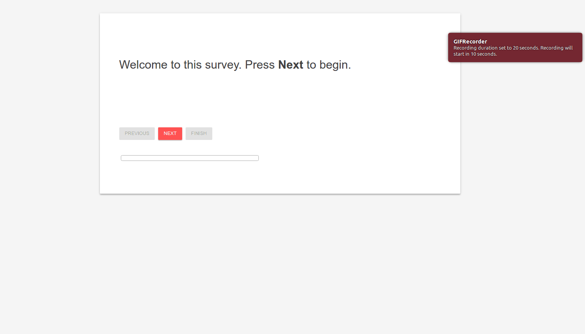

# Expfactory-survey

An experiment factory survey is a folder with a complete set of files for deploying a web-based survey, ideal for behavioral experiments or assessments. They use Google Material Design Lite styling, and generally look like this:

### How do I create a survey?
Creating a survey is easy, all you need to do is create a tab delimited file of questions, `survey.tsv`, a small configuration file for the Experiment Factory to understand your survey, `config.json`, and then copy it into one of the standard surveys folders. For example, you can use [the bis11](https://github.com/expfactory/surveys/tree/master/bis11_survey) as a template, replacing the config.json and survey.tsv with your own.

###### Survey.tsv
The survey.tsv file is a TAB delimited file that must have the following fields:

 - **question_type**: can be one of radio, instruction, textfield, textarea, numberic, or checkbox.
 - **question_text**: the text to proceed the potential responses. E.g., "How anxious do you feel in airports?"
 - **page_number**: The page number to render the question on.
 - **option_text**: comma separated list of option text (what the survey taker sees) E.g., a little anxious,somewhat anxious, very anxious
 - **option_values**: the values assigned to each option above. E.g., 1,2,3. The length of option_text and option_values must be equal.

It helps to look at [an example](https://github.com/expfactory/surveys/blob/master/bis11_survey/survey.tsv), and see what [it renders to](http://expfactory.github.io/bis11_survey.html).

###### config.json
The easiest way to generate a new config.json is to copy an old folder, use it as a template, and update the fields. Generally, it looks like this:

      [
          {
              "name": "BIS-11: Barratt Impulsiveness Scale Survey",
              "template":"survey",
              "run": [
                       "https://fonts.googleapis.com/css?family=Roboto:regular,bold,italic,thin,light,bolditalic,black,medium&amp;lang=en",
                       "https://fonts.googleapis.com/icon?family=Material+Icons",
                       "https://code.getmdl.io/1.1.1/material.blue-red.min.css",
                       "style.css",
                       "smoothness/jquery-ui-1.10.4.custom.min.css",
                       "https://code.jquery.com/jquery-2.2.4.min.js",
                       "https://code.getmdl.io/1.1.1/material.min.js",
                       "jquery-ui-1.10.4.custom.min.js",
                       "jquery.wizard.js",
                       "https://cdnjs.cloudflare.com/ajax/libs/jquery.form/3.50/jquery.form.min.js",
                       "https://cdnjs.cloudflare.com/ajax/libs/jquery-validate/1.12.0/jquery.validate.min.js"
                     ],
              "exp_id": "bis11_survey",
              "cognitive_atlas_task_id": "trm_55a6a8e81b7f4",
              "contributors": [
                               "Zeynep Enkavi",
                               "Ian Eisenberg",
                               "Patrick Bissett",
                               "Vanessa Sochat",
                               "Russell Poldrack"
                              ], 
              "time":999,
              "experiment_variables": "",
              "reference": "http://www.impulsivity.org/measurement/bis11",
              "notes": "",
              "publish":"True",
              "deployment_variables":{"material_design":
                                     {"fullscreen": true}
                             }
    
         }
      ]

For a simple survey, you can basically leave everything as is but update the `name`, `exp_id` and `cognitive_atlas_task_id` (we recommend you add your paradigm to the Cognitive Atlas to add supporting information and meta-data and use the unique id to link to it. Remember that the folder name (corresponding to the exp_id) must be all lowercase, with no special characters, and use "_" (underscores) instead of spaces.

Complete details [are available](http://expfactory.readthedocs.io/en/latest/development.html?highlight=config#config-json)

###### Validation and testing
You can use the Experiment Factory command line tools to test and preview your survey, and validate your config.json. Details [are available.](http://expfactory.readthedocs.io/en/latest/development.html?highlight=testing#testing)

###### supplementary files
If you have additional images, audio files, or media, just put them somewhere in your experiment folder, and link to them with relative paths in any relevant files.

### Issues or Questions?
Reach our to us! Post [an issue](https://www.github.com/expfactory/surveys/issues)
